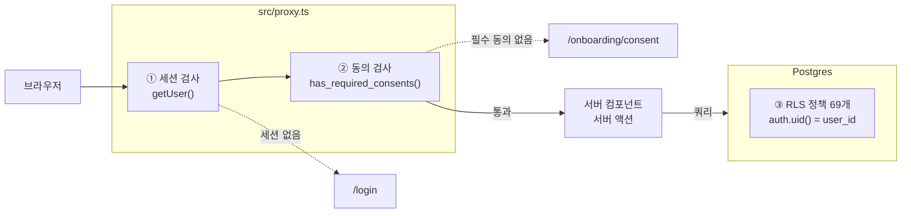
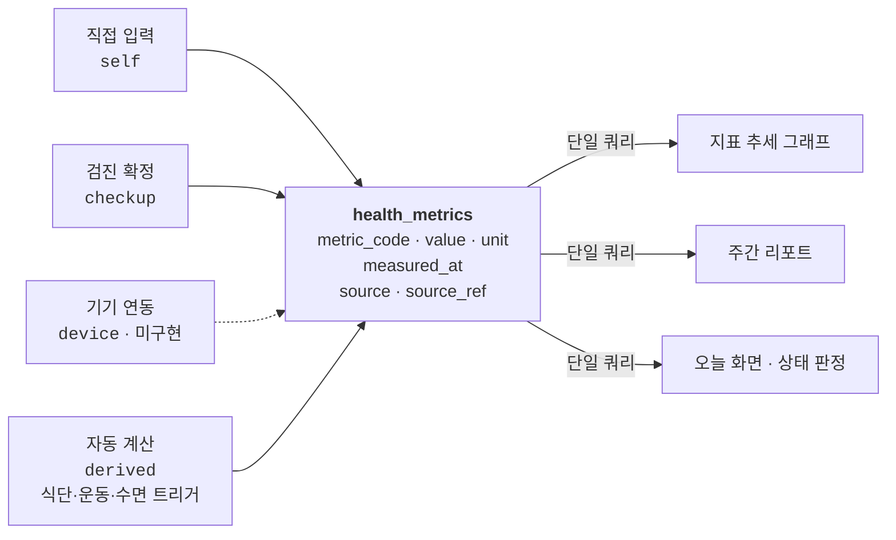
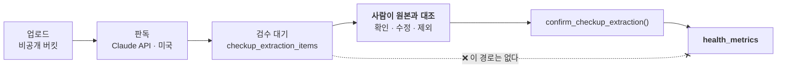
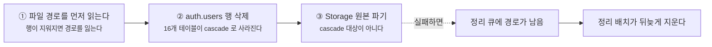

# 건강기록은 어떻게 만들어져 있나

식단·운동·복약·수면·신체수치·건강검진을 한 시간축에서 관리하는 웹 서비스입니다.
설계의 대부분은 *무엇을 넣을까*보다 **어디에 경계를 그을까**를 정하는 데 들어갔습니다.

| | |
|---|---|
| 애플리케이션 | 11,376줄 (TS/TSX 100개 파일) |
| 스키마·함수 | 2,727줄 (마이그레이션 9개) |
| 테이블 | 23 |
| RLS 정책 | 69 |
| DB 함수 | 35 (트리거 함수 13) |
| 트리거 | 26 |
| 지표 정의 | 35 |
| 테스트 | 84 |

---

## 1. 무엇으로 만들었나

Next.js 16 App Router 위에 Supabase(Postgres · Auth · Storage)를 올린 구성입니다.
화면은 대부분 서버 컴포넌트이고, 브라우저에서 도는 코드는 폼 상태와 그래프 정도로
제한했습니다.

| 층 | 선택 | 이유 |
|---|---|---|
| 프레임워크 | Next.js 16 (App Router) | 서버 컴포넌트로 건강 데이터를 서버에 두고, 브라우저로는 렌더 결과만 보낸다 |
| 데이터 | Supabase Postgres | RLS 로 행 단위 격리를 *DB 안에* 두기 위해. 애플리케이션 버그가 격리를 깨지 못한다 |
| 파일 | Supabase Storage (비공개 버킷) | 검진 결과지 원본. 10분 만료 signed URL 로만 열람 |
| 판독 | Claude API `claude-opus-5` | 결과지는 표·수치가 밀집한 문서라 정확도가 곧 제품 신뢰도 |
| 테스트 | Node 내장 러너 | 의존성 없이 `node --test`. 타입 스트리핑으로 `.ts` 직접 실행 |

Next 16 에서 `middleware.ts` 는 `proxy.ts` 로 이름이 바뀌었습니다. 이 프로젝트는
그 규약을 따릅니다 — 이름만 바뀐 게 아니라 export 하는 함수명도 `proxy` 입니다.

---

## 2. 요청이 화면이 되기까지

건강 데이터에 닿기까지 관문이 셋입니다. 앞의 둘은 애플리케이션에 있고,
**마지막 하나는 데이터베이스 안에 있습니다.**

①②는 애플리케이션 코드라 matcher 설정이 바뀌면 뚫릴 수 있지만, ③은 SQL 이
무엇을 요청하든 `auth.uid()` 와 맞지 않는 행을 돌려주지 않습니다. 그래서 두 층에
나눠 두었습니다.

세션 검사에서 `getSession()` 이 아니라 **`getUser()`** 를 씁니다. 앞의 것은 쿠키를
그대로 믿기 때문에 위조가 가능하고, 뒤의 것은 Supabase 서버에 토큰을 검증시킵니다.
매 요청 왕복이 한 번 더 생기지만 건강 데이터의 관문에서 아낄 비용이 아닙니다.

동의 검사는 `has_required_consents()` 하나를 호출합니다. 이 함수는 "폐기되지 않은
모든 필수 문서에 동의했는가"를 봅니다. 그래서 **새 약관을 발행하면 기존 이용자가
자동으로 재동의 대상이 됩니다** — 코드를 고칠 필요가 없습니다.

---

## 3. 설계의 축 — 수치는 전부 한 테이블에

이 제품에서 가장 중요한 결정입니다. 체중·혈압·혈당·콜레스테롤, 그리고 검진에서
나온 값과 식단에서 계산된 값이 **전부 `health_metrics` 한 테이블에 들어갑니다.**

출처가 달라도 같은 테이블에 들어갑니다. 그래서 "작년 검진에서 본 공복혈당이
그 뒤로 어떻게 변했나"가 조인 없이 한 쿼리로 나오고, 그래프 하나에 두 출처가
함께 올라갑니다. 도메인별로 테이블을 나눴다면 이 화면은 만들 수 없었습니다.

**지표를 늘릴 때는 `metric_definitions` 에 행 하나를 추가하면 끝입니다.**
스키마 변경이 없습니다.

대가도 있습니다. 값이 전부 `numeric` 한 컬럼에 들어가므로 지표마다 다른 제약을
걸 수 없습니다. 그래서 `metric_definitions` 에 `min_valid` / `max_valid` 를 두고
애플리케이션과 검수 화면에서 검사합니다. 스키마 제약보다 약한 보증이라는 걸
알고 택한 트레이드오프입니다.

> **판정하지 않는다**
>
> 상태 라벨은 **정상 · 주의 · 범위 밖 · 판정 기준 없음** 네 가지뿐입니다.
> 병명이나 진단성 표현은 코드 어디에도 없고, 이 경계는
> `src/lib/metrics/status.ts` 한 곳에서 강제됩니다. 의료기기가 아닌 상태를
> 유지하려면 이 선을 넘지 않아야 합니다.

---

## 4. 기록이 지표가 되는 법

식단을 기록하면 그날의 섭취 칼로리가 지표로 쌓이고, 수면을 기록하면 수면 시간이
지표가 됩니다. 이 계산은 애플리케이션이 아니라 **DB 트리거가 합니다.**

| 기록하면 | 트리거가 | 지표로 |
|---|---|---|
| 끼니 · 음식 항목 | `refresh_nutrition_metrics` | 섭취 칼로리 · 탄수 · 단백 · 지방 |
| 운동 | `refresh_exercise_metrics` | 운동 시간 · 소모 칼로리 |
| 수면 | `sync_sleep_duration_metric` | 수면 시간 |
| 체중 (키가 있으면) | `sync_bmi_metric` | 체질량지수 |

트리거에 둔 이유는 **일관성**입니다. 애플리케이션에서 계산하면 끼니를 수정·삭제하는
모든 경로에서 재계산을 잊지 않아야 하는데, 경로가 늘어날수록 반드시 하나를
빠뜨립니다. 트리거는 `meals` 와 `meal_items` 의 insert·update·delete 를 전부 잡습니다.

파생 지표는 하루에 하나여야 하므로 `source_ref` 로 upsert 합니다. 그런데 이 컬럼은
`uuid` 인데 키로 쓰고 싶은 건 날짜입니다. 그래서
`md5(kind || user_id || date)::uuid` 로 결정론적 UUID 를 만들어 씁니다 — 같은 날
같은 종류면 언제나 같은 값이 나옵니다.

---

## 5. 검진 판독 — 중요한 건 없는 경로다

결과지 PDF 나 사진을 올리면 검사 항목과 수치를 읽어냅니다. 이 기능에서 가장 많이
신경 쓴 것은 판독 정확도가 아니라, **판독 결과가 기록으로 넘어가는 길을 하나로
좁히는 것**이었습니다.

붉은 X 로 표시한 **없는 경로**가 이 설계의 핵심입니다. 판독은 틀릴 수 있고, 틀린
값이 조용히 기록에 들어가면 사용자는 그 값을 자기 수치로 믿습니다. 그래서 승격
경로를 DB 함수 하나로 좁히고, 그 함수는 `accepted` 또는 `edited` 로 표시된 항목만
처리합니다. 잘못 확정했을 때를 위한 되돌리기도 있습니다.

### 모델에게 코드를 지어내지 못하게 하기

판독은 Structured Outputs 로 JSON 스키마를 강제합니다. 여기서 한 가지를 더 했는데,
**지표 코드를 스키마의 `enum` 으로 박았습니다.**

자유 문자열로 두면 모델이 그럴듯한 코드를 지어내고, 그걸 서버에서 걸러내면 그
항목은 통째로 버려집니다. `enum` 이면 모델이 애초에 유효한 코드 아니면 `null` 만
낼 수 있습니다. 확신이 없을 때 `null` 을 내는 것이 지어내는 것보다 낫고, `null` 인
항목은 검수 화면 맨 위로 올라옵니다.

> **기획에서 틀렸던 것**
>
> 원래 계획은 인용(citations) 기능으로 원본 위치를 받아 검수 화면에서
> 하이라이트하는 것이었습니다. 실제로는 **Structured Outputs 와 함께 쓸 수
> 없습니다**(400). 대신 스키마에 `page_number` 를 두어 몇 쪽인지 표시하는 것으로
> 바꿨습니다.

---

## 6. 주간 리포트

한 주치 요약에 필요한 집계는 수면·식단·운동·복약·체중에 걸쳐 있습니다. 화면에서
다섯 번 왕복하는 대신 `weekly_report(offset)` 함수 하나가 한 행으로 돌려줍니다.

두 가지를 의도적으로 그렇게 뒀습니다.

- **증감에 색을 칠하지 않습니다.** 체중이 준 것이 누구에게나 좋은 일은 아니고,
  그 판단은 의료 행위에 가까워집니다. 방향(▲▼)과 양만 보여줍니다.
- **복약 예정 건수는 어제까지만 셉니다.** 오늘 저녁 약을 아직 안 먹은 것을
  "놓쳤다"로 세면 순응도가 하루 종일 낮게 나옵니다.

비교 로직은 `src/lib/reports/format.ts` 로 떼어내 테스트를 붙였습니다. 핵심은
**비교 대상이 없을 때 `null` 을 돌려주는 것**입니다 — `0` 으로 취급하면 지난주에
기록이 아예 없던 사람에게 "지난주 대비 −2,000kcal" 이 뜹니다.

---

## 7. 탈퇴하면 무엇이 어떤 순서로 사라지나

순서가 중요합니다. 두 단계 사이에서 실패했을 때 어느 쪽이 덜 나쁜지로 정했습니다.

2와 3 사이에서 실패하는 쪽을 택했습니다. 그쪽이 남기는 상태는 "지워야 할 파일이
남아 있다"이고, 이건 정리 큐가 회수합니다. 반대 순서였다면 — 파일을 먼저 지우고
계정 삭제가 실패하면 — 계정은 살아 있는데 결과지만 사라지고, 회수할 방법이 없습니다.

검진 하나를 개별 삭제할 때도 같은 문제가 있었습니다. `health_metrics.source_ref` 는
여러 출처를 한 컬럼으로 가리키느라 외래키가 아니라서, 검진을 지워도 그 검진에서
확정한 수치가 남았습니다. 추출 행이 cascade 로 사라지면 되돌리기로도 못 지우는
상태가 됩니다 — 사용자가 지운 검진의 값이 그래프에 영영 남습니다. 트리거로 함께
지웁니다.

---

## 8. 무엇을 어떻게 확인했나

이 프로젝트의 위험은 대부분 **조용히 틀리는 것**입니다. 화면이 깨지면 바로 보이지만,
격리가 뚫리거나 판정 경계가 밀리면 아무 일도 없어 보입니다.

| 층 | 도구 | 무엇을 막는가 |
|---|---|---|
| 순수 로직 | Node 내장 러너 · 84개 | 지표 판정 경계값, 자정을 넘는 수면 계산, 비교 대상 없을 때의 델타, 접두사가 겹치는 경로로 게이트가 뚫리는 것 |
| 스키마 · RLS | 임시 Postgres + 검증 SQL | 두 사용자 간 격리, 남의 추출을 확정하려는 시도, 권한 회수 후 직접 호출, 탈퇴 시 전 테이블 정리 |
| 접근성 | 대비 검사 스크립트 | 4.5:1 은 눈으로 판별되는 경계가 아니다 |
| 전체 | GitHub Actions | 위 셋 + 빌드 + 마이그레이션 9개 실제 적용 |

RLS 검증은 스크래치 Postgres 에 Supabase 의 `auth`·`storage` 스키마를 흉내 낸 스텁을
올리고, 마이그레이션 전체를 적용한 뒤 실제로 `set role authenticated` 로 전환해
확인합니다. 두 사용자를 만들어 한쪽에서 다른 쪽 데이터가 보이는지, 남의 `user_id` 로
쓰기가 막히는지를 직접 봅니다.

> **측정이 틀렸던 적**
>
> 권한 검증을 처음 돌렸을 때 모든 함수가 열려 있는 것으로 나왔습니다. 원인은
> 테스트 파일이 마이그레이션 뒤에
> `grant execute on all functions … to authenticated` 를 실행하고 있었기
> 때문입니다 — **검증하려던 REVOKE 를 테스트가 덮어쓰고 있었습니다.**
>
> CI 도 비슷한 것을 잡았습니다. 마이그레이션 루프가 `psql … ; echo "OK"` 형태라
> **전부 깨져도 초록불**이었습니다. 일부러 깨뜨린 마이그레이션을 넣어 빨간불이
> 되는지 확인하고서야 고쳐졌습니다.

---

## 9. 일부러 하지 않은 것

빠진 게 아니라 넣지 않기로 한 것들입니다. 대부분 "편리하지만 사용자를 속이게 되는"
종류입니다.

| 하지 않은 것 | 이유 |
|---|---|
| 오프라인 임시 저장 | 복약 체크가 서버에 닿지 않았는데 "저장됨"으로 보이면, 사용자는 먹었다고 믿고 다시 먹지 않는다 |
| 서비스 워커에 데이터 캐시 | 화면 HTML 과 RSC 페이로드에는 복약 이력과 검진 수치가 실려 있고, 워커 캐시는 로그아웃한 뒤에도 디스크에 남는다 |
| 판독 결과 자동 저장 | 가장 편리했을 기능이지만, 틀린 값이 조용히 들어가면 사용자는 그것을 자기 수치로 믿는다 |
| 증감에 좋고 나쁨 색칠 | 체중이 준 것이 누구에게나 좋은 일은 아니다. 그 판단은 의료 행위에 가까워진다 |
| 오류 메시지 화면 표시 | 오류 메시지에 복약 이력이나 검진 수치가 섞일 수 있고, 캡처해 공유하는 순간 노출이 된다. digest 만 보여준다 |
| 404 대신 "권한 없음" | 존재 여부를 알려주는 것만으로도 누가 어떤 검진을 받았는지가 샌다 |
| 약관 문서에 HTML 허용 | 본문은 평문으로 렌더링한다. HTML 을 허용하면 문서 편집이 곧 XSS 통로가 된다 |

---

기획 배경은 [`PLAN.md`](PLAN.md), 오픈 전 남은 일은 [`RELEASE.md`](RELEASE.md),
동의 문서 검토 결과는 [`LEGAL_REVIEW.md`](LEGAL_REVIEW.md) 에 있습니다.
